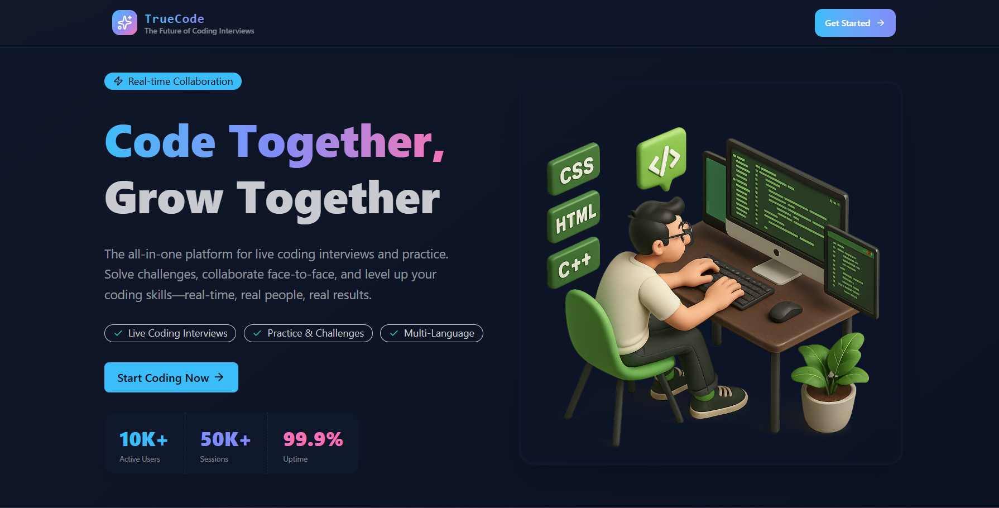
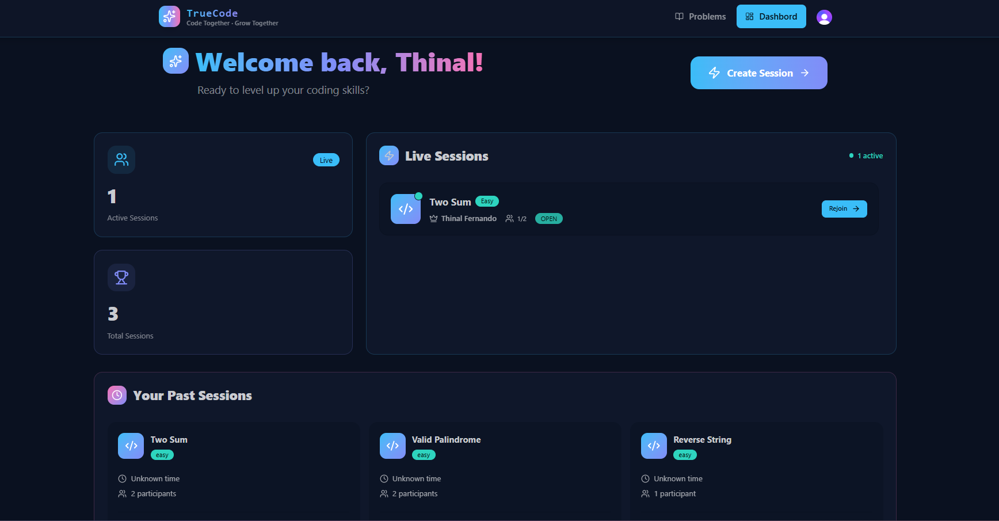
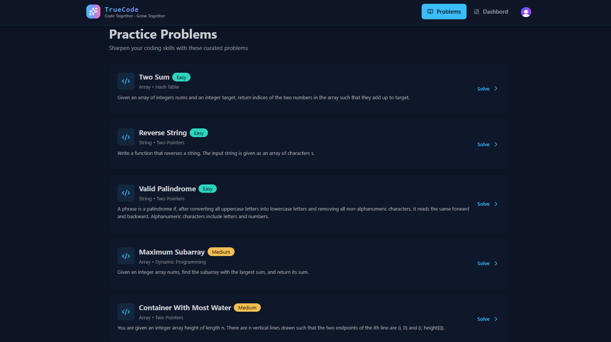
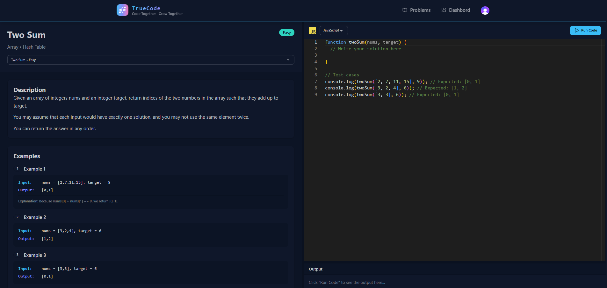
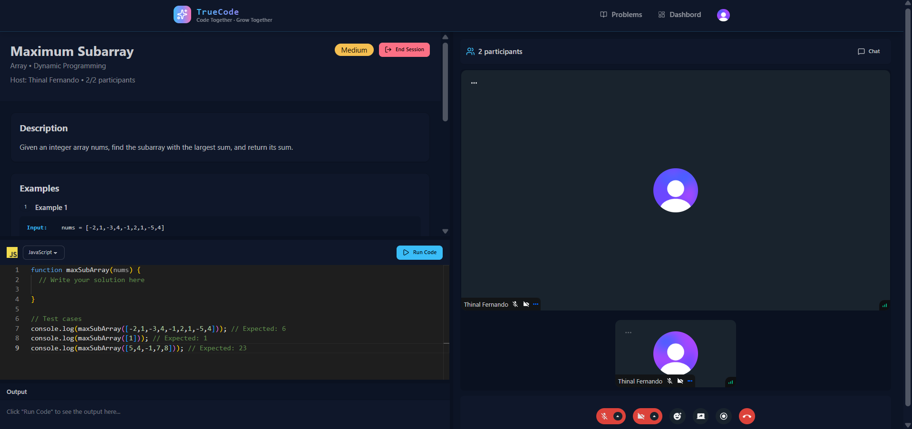
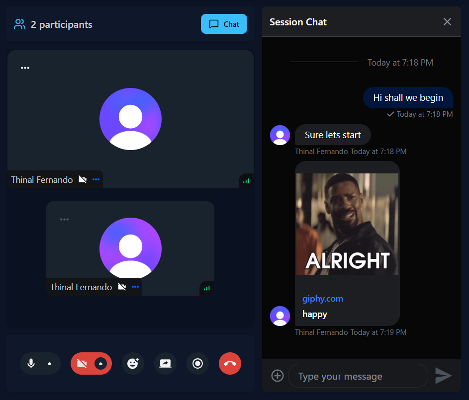

# 🧑‍💻TrueCode – Real-Time Coding Interview & Practice Platform


**TrueCode** is a full-stack web platform designed to help developers **practice coding interviews together in real time**. It allows friends, interviewers, or recruiters to create interview sessions where participants can **solve coding problems collaboratively while communicating through video, chat, and a shared code editor**.

The platform simulates a **real technical interview environment**, enabling users to practice solving problems, discuss solutions, and receive immediate feedback on their code.

Users can either:
- Upload their own coding questions
- Select a programming language and solve problems
- Input interview questions manually
- Upload a CV to generate interview-style questions

TrueCode aims to make **technical interview preparation interactive and realistic**.

---

## ✨Key Features

### 📋Live Interview Sessions
- Create real-time coding interview sessions
- One-to-one interview environment
- Rooms automatically lock when two users join

### 💻Real-Time Code Editor
- Integrated editor powered by **Monaco (VS Code engine)**
- Supports multiple programming languages:
  - JavaScript
  - Python
  - Java
- Run and test code instantly

### 🎥Video Communication
- Built-in video calling between participants
- Toggle camera and microphone
- Screen sharing support
- Real-time reactions

### 💬Chat & Messaging
- Send messages during interview sessions
- Threaded replies
- Message reactions
- Image uploads

### 🧑‍💻Coding Practice Mode
- Solve coding problems individually
- Execute code and receive **success/fail feedback**
- Output is automatically compared with expected results

### 🔐Authentication
- Secure user authentication
- Login required before accessing the platform

---

## 🛠️Tech Stack

### Frontend
- React (Vite)
- Tailwind CSS
- DaisyUI
- TanStack Query

### Backend
- Node.js
- Express.js

### Database
- MongoDB
- Mongoose

### Authentication
- Clerk

### Real-Time Communication
- Stream API (video calls and messaging)

### Dev Tools
- Git & GitHub workflow
- Pull requests and branching
- CodeRabbit AI for code reviews

---

## 🎮How to Use TrueCode
As an Interviewer
1. Sign in and go to the Dashboard
2. Click Create Session — choose a problem or upload your own
3. Share the session link with your candidate
4. Once they join, the room locks automatically
5. Use the code editor, video call, and chat to conduct the interview
6. End the session when done — the recording and transcript are saved

As a Candidate / Friend Practicing
1. Sign in and check the Dashboard for live sessions to join
2. Or use the Problems page to solo practice — pick a problem, write code, run it, and get instant feedback

AI Question Generation
* Upload a CV or job description on the session creation page
* TrueCode will generate relevant interview questions automatically
* You can also type or paste your own questions directly

---


## Project Architecture

```
TrueCode
│
├── backend
│   ├── src
│   │   ├── controllers
│   │   ├── models
│   │   ├── routes
│   │   ├── middleware
│   │   └── lib
│   │
│   └── server.js
│
├── frontend
│   ├── src
│   │   ├── components
│   │   ├── pages
│   │   └── hooks
│
└── README.md
```

---

## 🚀Installation

### 1. Clone the repository

```bash
git clone https://github.com/yourusername/TrueCode.git
cd TrueCode
```

### 2. Install dependencies

Backend:

```bash
cd backend
npm install
```

Frontend:

```bash
cd ../frontend
npm install
```

---

## Environment Variables

Create a `.env` file in the backend folder.

Example:

```
PORT=3000
DB_URL=your_mongodb_connection_string
NODE_ENV=development
```

You will also need API keys for:
- Clerk Authentication
- Stream API

---

## Run the Application

Start backend:

```bash
cd backend
npm run dev
```

Start frontend:

```bash
cd frontend
npm run dev
```


---

## Future Improvements

- AI-generated interview questions
- More programming language support
- Collaborative coding (multiple cursors)
- Interview feedback scoring
- Interview recording playback

---

## Learning Outcomes

Through this project I practiced:

- Building a **full-stack MERN application**
- Implementing **real-time video and messaging features**
- Using **external APIs for authentication and communication**
- Structuring a scalable **Node.js backend**
- Managing code with **Git branching and pull requests**
- Deploying a full-stack application

---

## Demo

<p align="center">
  
  <br>Home Page
</p>
<br>
<p align="center">
  
  <br>User Dashboard
</p>
<br>
<p align="center">
  
  <br>List of Problems
</p>
<br>
<p align="center">
  
  <br>Problem Editor
</p>
<br>
<p align="center">
  
  <br>Interview
</p>
<br>
<p align="center">
  
  <br>Chat application
</p>


---
## 📄 License
This project is licensed under the MIT License — see the LICENSE file for details.
